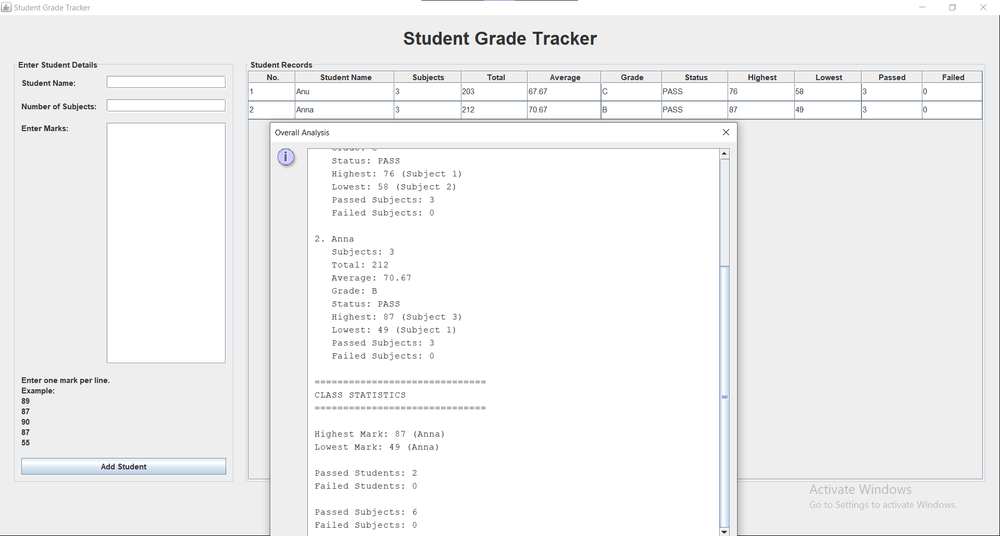

# CodeAlpha Student Grade Tracker

## About the Project

Student Grade Tracker is a Java-based application developed as part of the CodeAlpha Java Programming Internship.

The application allows users to enter student details and grades and generates a summary of the students' marks.

## Features

- Add student details
- Enter student grades
- Calculate average marks
- Find highest marks
- Find lowest marks
- Display student grade summary

## Technologies Used

- Java
- Object-Oriented Programming (OOP)
- Arrays / ArrayList
- Console-based Application

## How to Run

1. Clone or download this repository.
2. Open the project in IntelliJ IDEA or any Java IDE.
3. Open the main Java file.
4. Compile and run the program.
5. Enter the required student details and grades.

## Sample Output



## Project Structure

```text
CodeAlpha_StudentGradeTracker
│
├── src
│   └── StudentGradeTracker.java
│
├── screenshots
│   └── StudentGradeTracker.png
│
└── README.md
